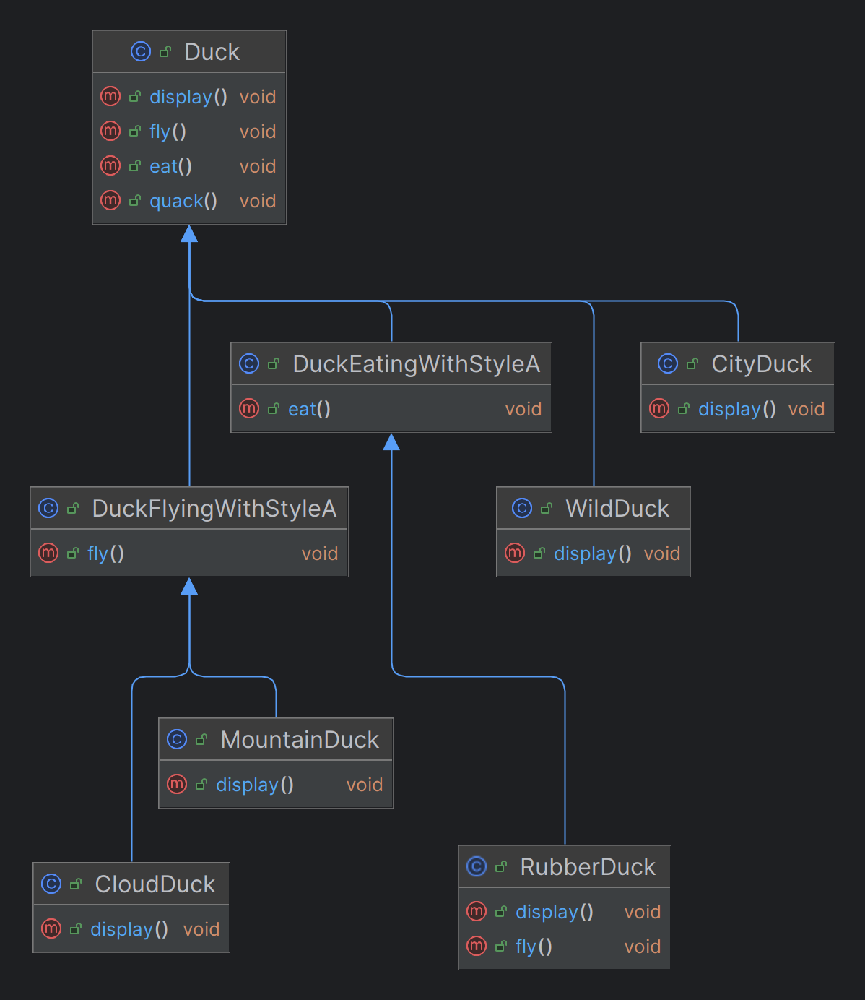
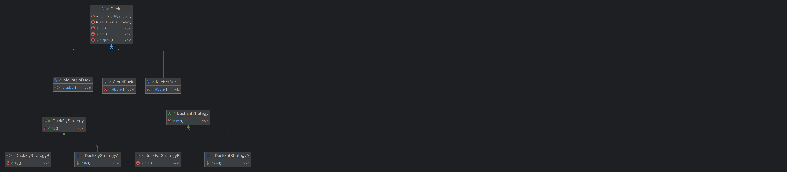

### Lets say
- MountainDuck and CloudDuck has same flying method
- MountainDuck and RubberDuck has same flying method

### Only way to support both is duplication of code
- As behaviour cannot be shared on same level of inheritance, only down
- No way to fulfill these criteria without code duplication.

## Using Strategy Pattern

